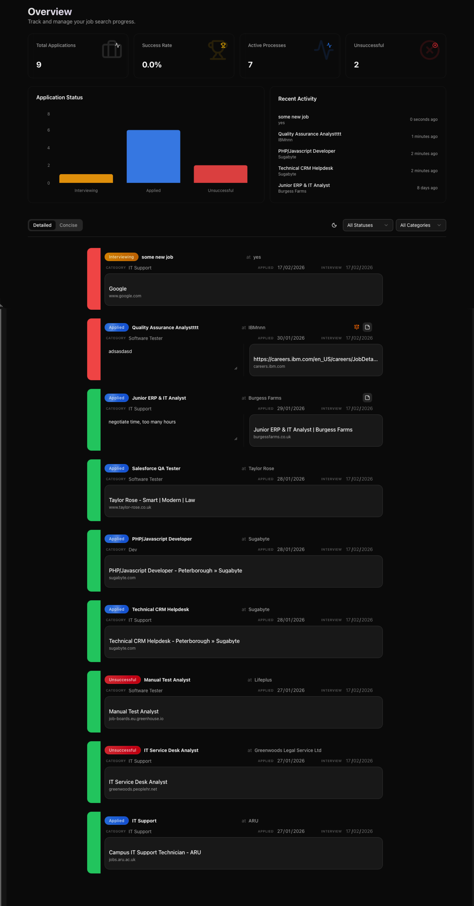

# JobQuest

A modern, intuitive job application tracker designed to streamline your job search process. Built with Next.js, Prisma, and Tailwind CSS, JobQuest provides a centralised dashboard to manage applications, track status, and organise your job search journey.

Orchestrated using **Google Antigravity** (an advanced agentic AI coding assistant designed by Google DeepMind).



## 🚀 Features

-   **Kanban-Style Experience**: Visualise your applications across different stages (Wishlist, Applied, Interview, Offer, Rejected).
-   **Detailed Tracking**: Store comprehensive information for each job, including role, company, salary, and notes.
-   **Data Persistence**: robust backend integration with Prisma ORM for reliable data storage.
-   **Responsive Design**: Fully responsive interface that works seamlessly on desktop and mobile devices.
-   **Modern UI**: Clean and accessible user interface built with Shadcn UI and Tailwind CSS.
-   **Secure Access**: Simple password protection for personal deployment.

## 🛠️ Tech Stack

-   **Frontend**: [Next.js 14](https://nextjs.org/) (App Router), React, [Tailwind CSS](https://tailwindcss.com/), [Shadcn UI](https://ui.shadcn.com/)
-   **Backend**: Next.js Server Actions, [Prisma ORM](https://www.prisma.io/)
-   **Database**: SQLite (default for development), compatible with PostgreSQL/MySQL.
-   **Tools**: TypeScript, Zod (Validation), Jest (Testing).

## 🏁 Getting Started

Follow these steps to get the project up and running locally.

### Prerequisites

-   Node.js (v18 or higher)
-   npm or yarn

### Installation

1.  **Clone the repository:**

    ```bash
    git clone https://github.com/yourusername/jobquest.git
    cd jobquest
    ```

2.  **Install dependencies:**

    ```bash
    npm install
    ```

3.  **Environment Setup:**

    Create a `.env` file in the root directory by copying the example:

    ```bash
    cp .env.example .env
    ```

    Open `.env` and configure your variables:

    ```env
    DATABASE_URL="file:./dev.db" # Default SQLite database
    APP_PASSWORD="your_secure_password" # Set a password for app access
    ```

4.  **Database Setup:**

    Initialise the database schema:

    ```bash
    npx prisma generate
    npx prisma db push
    ```

5.  **Run the Application:**

    ```bash
    npm run dev
    ```

    Open [http://localhost:3000](http://localhost:3000) (or the port shown in your terminal) to view the app.

## 🎥 Demo

[Watch the App Demo](./public/assets/app-demo.mp4)

## 🧪 Running Tests

To run the test suite:

```bash
npm test
```

## 📄 Licence

This project is open-source and available under the [MIT Licence](LICENSE).
